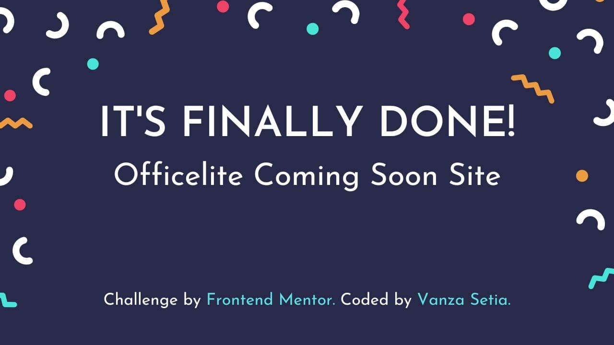

<p align="left">
  <a href="https://www.frontendmentor.io/challenges?difficulties=2"></a>
  
  <a href="https://twitter.com/vanzasetia"></a>
  
  
  
</p>

<p>
  <a href="http://jigsaw.w3.org/css-validator/check/referer">
    
    </a>
    <a href="https://github.com/standard/semistandard">
      
    </a>
</p>

# Officelite Coming Soon Site

## Table of contents
- [Overview](#overview)
  - [Introduction](#introduction)
  - [The challenge](#the-challenge)
  - [Links](#links)
- [My process](#my-process)
  - [Built with](#built-with)
  - [What I Learned](#what-i-learned)
  - [Useful resources](#useful-resources)
- [Author](#author)
- [License](#license)
- [References](#references)

## Overview
[(Back to top)](#table-of-contents)

### Introduction
Welcome to the `README.md` of this repo! The purpose of creating this project is to practice using modern CSS such as `clamp()`, `calc()`, CSS logical properties, and much more.

In this file I'm going to tell you everything, starting from tools that I used, and much more.

That's it for the introduction and **happy reading!**

### The Challenge

- View the optimal layout for the site depending on their device's screen size
- See hover states for all interactive elements on the page
- See error states when the contact form is submitted if:
  - The Phone Number and/or Email Address fields are empty
  - The Email Address is not formatted correctly
- See visible focus states for interactive elements when navigating by keyboard
- Understand and be able to navigate page content while using assistive technology
- **Bonus**: See a live countdown timer that ticks down every second
- **Bonus**: See a custom-styled select form control in the sign-up form

### Links
- [Live Review](https://officelitetool.netlify.app/)
- [Frontend Mentor Solution Page](https://www.frontendmentor.io/solutions/officelite-coming-soon-site-html-css-sass-javascript-1G1soh4Ah6)

## My Process
[(Back to top)](#table-of-contents)

### Built With
- HTML Semantic Tags
- [BEM (Block, Element, Modifier)](https://sparkbox.com/foundry/bem_by_example)
- [Sass](https://sass-lang.com/)
- JavaScript
- CSS Flexbox
- CSS Grid
- CSS Logical Properties
- Fluid Typography
- Fluid Space
- Mobile-first workflow

### What I Learned

#### Separation of Concerns

HTML, CSS, and JavaScript are three different things. As a developer, I should not mix them as much as possible.

> Learn more about [separation of concerns at Wikipedia](https://en.wikipedia.org/wiki/Separation_of_concerns)

I am going to use the following HTML markup to show you how we can apply that in practice.

```html
<div class="form__wrapper">
  <label
    for="email-input"
    id="email-label"
    class="form__label"
    hidden
  >
    Email Address
  </label>
  <input
    type="email"
    id="email-input"
    class="form__input js-input"
    name="email"
    placeholder="Email Address"
    required
    aria-labelledby="email-label"
    aria-describedby="email-alert"
    data-id="email"
  />
  <p
    id="email-alert"
    class="js-alert"
    aria-live="polite"
    hidden
    data-id="email"
  ></p>
</div>
```

There are a lot of things going on in this HTML markup. So, let me explain it.

##### Accessibility

First, let's focus only on the HTML markup. This is where the accessibility is happening.

```html
<div>
  <label
    for="email-input"
    id="email-label"
    hidden
  >
    Email Address
  </label>
  <input
    type="email"
    id="email-input"
    name="email"
    placeholder="Email Address"
    required
    aria-labelledby="email-label"
    aria-describedby="email-alert"
  />
  <p
    id="email-alert"
    aria-live="polite"
    hidden
  ></p>
</div>
```

There are five important things here.

- The input has a hidden label.
- Correct `type` for the `input`.
- The `p` for the input error message is linked with `aria-describedby`.
- The `p` also has `aria-live` attribute to make screen readers pronounce it when the error message is in the `p`.
- The `p` is hidden since the error message won't be visible. So, when the input is invalid state the `hidden` will be replaced by `sr-only` class.

##### Styling

Second, I should be able to focus on the same HTML markup but with "CSS in mind". So, I should only care about styling.

Don't use `aria-live` as the selector because it has nothing to do with CSS. It's for accessibility.

Don't make the CSS selector like the structure of the HTML. For example, `div > label`. It's because if I decided to have another `div` that wrapped the `label` then, the styling will be broken.

So, I need to have class only for styling purposes. This way, if I change the HTML, the styling won't get affected.

```html
<div class="form__wrapper">
  <label>
    Email Address
  </label>
  <input class="form__input" />
  <p></p>
</div>
```

For the styling, I only need to care about the `div` and the `input`. The `label` is hidden and so is the `p`.

Then, when the input is in an invalid state, there should be `is-invalid` class.

```html
<input class="form__input is-invalid" />
```

##### JavaScript

Lastly, for JavaScript, I will use `js-` class selectors to grab the DOM elements. This way, the CSS selectors and the JavaScript selectors are separated.

```html
<div>
  <label>
    Email Address
  </label>
  <input class="js-input" data-id="email" />
  <p data-id="email"></p>
</div>
```

I use `data-id` to match the `input` and the associated error message.

Of course, I can do the following inside to select the error message the JavaScript.

```javascript
const handleAlert = (message, input) => {
  const inputParentElement = input.parentElement;
  const alert = inputParentElement.querySelector(".js-alert");
  showAlert(message, alert, input);
}
```

But, this JavaScript code is *always* assumes that the alert element has the same parent element as the `input`. So, if in the future the error message is not having the same parent element. Then, I need to refactor my JavaScript.

So, by using `data-id`, I don't need to worry about the HTML structure. The error element can be everywhere and it will always be matching with the `input`.

This is how I apply the separation of concerns principle. 😎

### Useful Resources

- [Andy Bell – Be the browser’s mentor, not its micromanager - YouTube](https://youtu.be/5uhIiI9Ld5M) - This video helped me understand the fluid type and fluid space. This approach helped reduce the amount of media queries by using modern CSS such as `clamp()`, `calc()`, and much more!
- [Stephanie Eeckles - Scaling CSS Layout Beyond Pixels - YouTube](https://youtu.be/8slZJrTK3nE) - This video helped me understand how to use modern CSS such as using `clamp()`, CSS Grid (`minmax()`, `auto-fit`, etc), and much more!
- [Utopia](https://utopia.fyi/) - This a great calculator that helped generating `clamp()` functions. It helped me creating fluid space and fluid typography easily.

## Author
[(Back to top)](#table-of-contents)

- Frontend Mentor - [@vanzasetia](https://frontendmentor.io/profile/vanzasetia)
- Twitter - [@vanzasetia](https://twitter.com/vanzasetia)
- Code Newbie - [@vanzasetia](https://community.codenewbie.org/vanzasetia)
- Want to see me on other platforms? [Check my linktree!](https://linktr.ee/vanzasetia)

## License
[(Back to top)](#table-of-contents)

>You can check out [the full license](./LICENSE)

This project is licensed under the terms of the MIT license.

## References
[(Back to top)](#table-of-contents)

> See the [documentation.](./docs/README.md)
